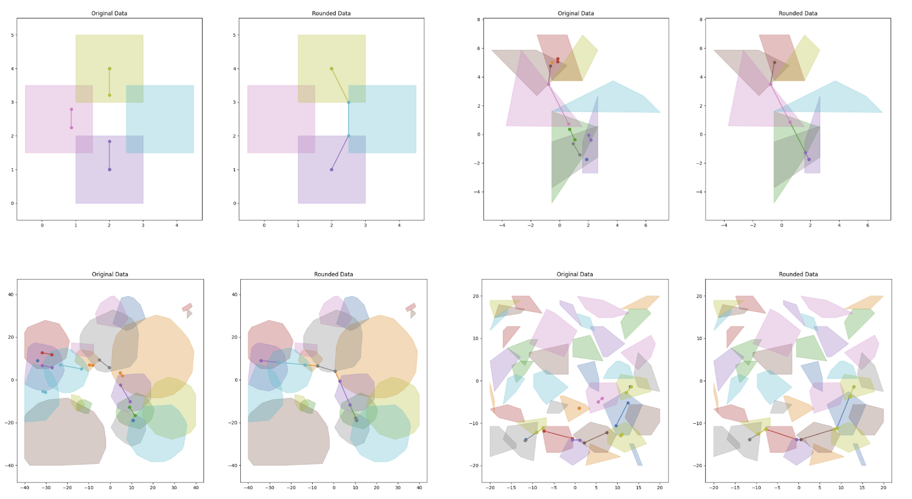

# A Parallelized Solver for Piecewise-Linear Shortest Paths in a Graph of Convex Sets (GCS) Using the Alternating Directions Method of Multipliers (ADMM)

A novel solver for Piecewise-Linear Shortest Paths [Graph of Convex Sets (GCS) optimization problems](https://groups.csail.mit.edu/robotics-center/public_papers/Marcucci24a.pdf) using the [Alternating Directions Method of Multipliers (ADMM)](https://web.stanford.edu/~boyd/admm.html). In this project, we implemented a few ADMM splitting methods to solve GCS, validating our approach on some simple shortest-path planning problems in 2D. This is early, proof-of-concept work toward a faster, parallelized, ADMM-based solver for general GCS problems.

See the [technical report](https://github.com/Michaelszeng/GCS-ADMM/blob/master/Project_Report.pdf) for more technical details.

Special thanks to [Alex Amice](https://alexandreamice.github.io/) for the amazing teaching and guidance.

## Solvers

This repository contains 4 solvers:
 - `classic_solver.py` uses MOSEK with no use of ADMM, included as a baseline for comparison. 
 - `admm_solver_v1.py` uses the "combined-edge-update vertex-edge split" ADMM method described in the report.
 - `admm_solver_v2.py` uses the "sequential-edge-update vertex-edge split" ADMM method described in the report.
 - `admm_solver_v3.py` uses the "full-vertex split" ADMM method described in the report. This is the ADMM-based implementation that seems to work best so far.

## Installation

    pip install pandas
    pip install numpy
    pip install drake
    pip install scipy
    pip install matplotlib

## Running

Run any of the following (depending on which solve you want to use): 

    python classic_solver.py --test_file <name_of_test_file>
    python admm_solver_v1.py --test_file <name_of_test_file>
    python admm_solver_v2.py --test_file <name_of_test_file>
    python admm_solver_v3.py --test_file <name_of_test_file>

where `<name_of_test_file>` is the name of the desired test file in the `test_data` directory.

You can generate new test cases using `python test_generator.py`. The parameters passed to `generate_test_2D()` can be modified to change the parameters of the test.

To replicate the experiments shown in the report, run `chmod +x run_benchmarks.sh` to make the benchmarking script executable, then execute it using `./run_benchmarks.sh`.

## Core References
 [1] T. Marcucci, Graphs of Convex Sets with Applications to Optimal Control and Motion Planning. PhD thesis, Massachusetts Institute of Technology, May
 2024. Doctor of Philosophy Thesis.

 [2] S. Boyd, N. Parikh, E. Chu, B. Peleato, and J. Eckstein, Distributed Optimization and Statistical Learning via the Alternating Direction Method of
 Multipliers. 2011.

 [3] T. Marcucci, J. Umenberger, P. Parrilo, and R. Tedrake, “Shortest paths in graphs of convex sets,” SIAM Journal on Optimization, vol. 34, p. 507–532,
 Feb. 2024.
 
 [4] T. Marcucci, M. Petersen, D. von Wrangel, and R. Tedrake, “Motion Planning around Obstacles with Convex Optimization,” arXiv preprint arXiv:2205.04422, 2022. [Online]. Available: https://arxiv.org/abs/2205.04422.